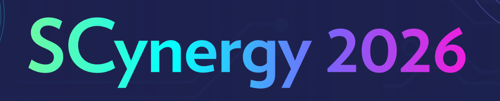

{ width="640" } 

# Getting Started with MeluXina

This tutorial is given in the context of the [Scynergy 2026 event](https://www.scynergy.events/) and [EPICURE](https://epicure-hpc.eu/). It offers to the participants a quick overview of the different ways to access and use [MeluXina supercomputer](https://docs.lxp.lu/system/overview/). 

## Agenda

- Presentation
- Connecting to MeluXina
- HPC workflow
- AI workflow

## About this course

{ align=left width="250" }

This course has been developed by the **Supercomputing Application Services** group at LuxProvide in the context of the EPICURE project.

